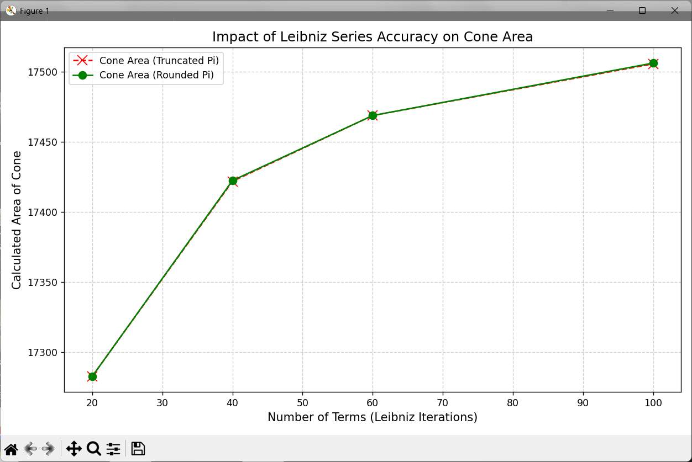

# Computational Lab: Visualizing Error Propagation with the Leibniz Series

**Project Overview**

This experiment investigates how small numerical differences—specifically **Truncation vs. Rounding**—affect the calculation of $\pi$ over time. Using Python, we simulate a "Rocket Cone" to demonstrate how these initial approximations diverge as we increase the number of iterations in the **Leibniz infinite series**:

$$\frac{\pi}{4} = 1 - \frac{1}{3} + \frac{1}{5} - \frac{1}{7} + \dots$$

## Methodology

Instead of using a pre-defined value for $\pi$, we manually calculate it at four specific milestones: the **20th, 40th, 60th, and 100th terms**. At each step, we apply two distinct baselines to the partial sum:

* **Baseline A (Truncation):** The value is cut off at the 4th decimal place (e.g., $3.1415$).
* **Baseline B (Rounding):** The value is rounded to the nearest 4th decimal place (e.g., $3.1416$).

## Analysis of the "Gap"

The core of this project is measuring the **Gap**—the absolute difference between the truncated and rounded values at each milestone.

By feeding these two different $\pi$ values into the formula for the **Lateral Surface Area of a Cone**, we can visualize how a tiny numerical decision (truncating vs. rounding) propagates into a significant difference in the final calculated geometry.

## Visual Representation

### Console Output
Running the script prints the comparison table. The exact numbers and an explanation of when the gap is 0 vs 0.0001 are shown below.

### Visualization
The graph compares the calculated cone areas step-by-step.

